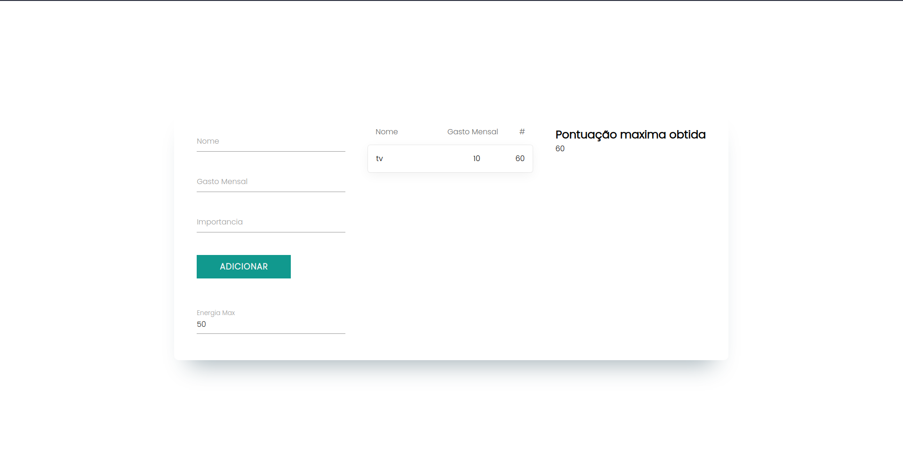
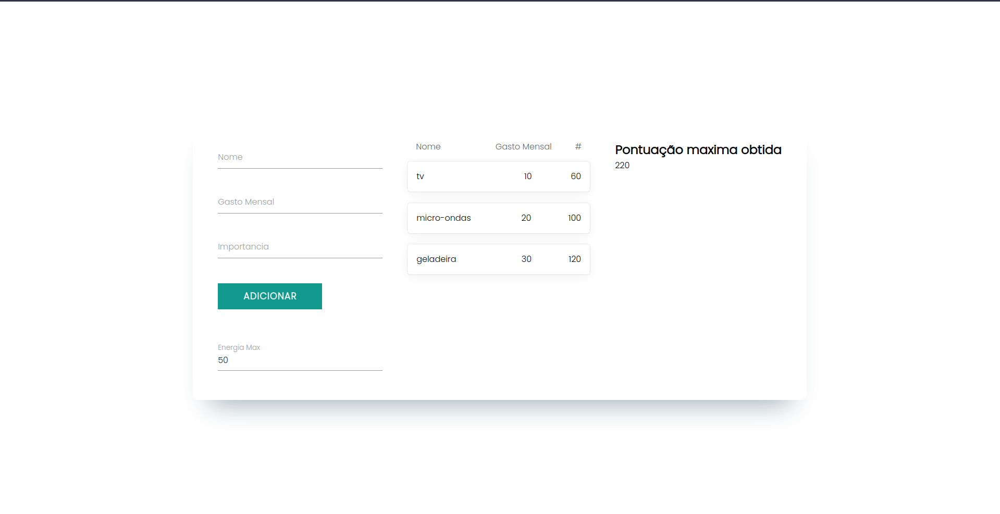

# PD_HomeEnergyManagement

**Número da Lista**: 15<br>
**Conteúdo da Disciplina**: PD<br>

## Alunos

| Matrícula  | Aluno                      |
| ---------- | -------------------------- |
| 18/0113151 | Eduardo Nunes Pícolo       |
| 14/0065547 | Roberto Martins da Nóbrega |

## Sobre

Sistema para escolher eletrodomesticos/eletrônicos de maior importância do usuário em relação ao custo máximo que o mesmo está disposto a gastar mensalmente com a conta de energia.

## Screenshots




## Instalação

**Linguagem**: JavaScript<br>
**Framework**: React JS<br>

Para rodar o projeto, você precisa seguir as seguintes instruções:

1. Clonar o repositório

```
https://github.com/projeto-de-algoritmos/PD_HomeEnergyManagement.git
```

2. Entrar na pasta PD_HomeEnergyManagement e instalar as dependências por meio de:

```
yarn install
```

3. Inicializar a aplicação

```
yarn start
```
